# SailVina - Autodock Vina分子对接全套整合软件
在线文档见：<https://github.com/beikwx/SailVina>  
Word文档下载：[百度网盘](https://pan.baidu.com/s/19moBZp5TjZiKjDIW0R7edw) 
提取码：eow2  
exe版本下载：[百度网盘](https://pan.baidu.com/s/1Haas2vvBgiHHrg-rnVzQoQ)
提取码：7711   
python版本下载：[百度网盘](https://pan.baidu.com/s/16Sj_AtlagxwbF3fNaMST-A) 提取码：ykxb 

## 目录
[1. 介绍](#1-介绍)  
[2. 安装SailVina](#2-安装SailVina)  
[3. 常用操作教程](#3-常用操作教程)  
[3.1 获取受体](#31-获取受体)  
[3.2 准备受体](#32-准备受体)  
[3.3 准备对接位点](#33-准备对接位点)  
[3.4 准备配体](#34-准备配体)  
[3.5 分子对接](#35-分子对接)  
[3.6 查看分数](#36-查看分数)  
[3.7 生成配体-受体复合物](#37-生成配体-受体复合物)  
[3.8 作用力分析](#38-作用力分析)  
[4. 其他功能](#4-其他功能)  
[5. 常见问题](#5-常见问题)

## 1. 介绍

SailVina只是一个带界面的脚本，批量调用Autodock
Vina，openbabel等来便捷的进行分子对接。

本软件可以实现以下功能：

1.  下载受体；自动准备受体。

2.  配体格式转换；根据取代基批量生成配体。

3.  验证对接方案(Protocol)是否可以还原实验结果。

4.  单个/多个配体和单个/多个受体进行对接。

5.  将对接的多个配体提取出来。

6.  提取对接的分数；批量提取分数，并选择性的提取结果。

7.  将配体和受体合并成一个文件。

8.  计算两个/多个小分子之间的RMSD值。

这已经是最终的版本，目前不会再添加新功能。其中大部分方法基本参考自官方文档和文献，如果有疏漏或者错误欢迎指出。同时欢迎对项目进行再制作，本人也只是个业余喜欢编程的菜鸟，代码可能不太好看，欢迎交流讨论。

## 2. 安装SailVina

必要软件（安装完整路径切记不要有中文和空格！！比如C:/program
files/mgltools和D:/软件/mgltools等都是不合法的！!运行脚本可能会出现意想不到的错误！）

a. [Mgltools](<http://mgltools.scripps.edu/downloads>)：用于调用pdbqt转换脚本。  
[百度网盘](https://pan.baidu.com/s/1GxGjxp7AgbHzN5jobC9lSQ) 提取码：ueeo  
b.[Openbabel](<https://sourceforge.net/projects/openbabel/files/openbabel/2.4.1/>)：用于格式转换。  
[百度网盘](https://pan.baidu.com/s/1zZMeU15UTfc4dk3W7lBH0w) 提取码：m8o9    

可选软件  
a.  ChemOffice：用于化学结构的绘制和格式转换。  
b. [Pymol](https://pymol.org/2/)：用于查看结构。

### 2.1 方法一：使用python运行 
安装python3，任何版本都可以，推荐python3.6或者python3.7。使用pip命令安装额外运行库：

requests（下载受体）pip install requests

lxml（下载受体）pip install lxml

Biopython（修复受体）pip install Biopython

scipy（计算RMSD）pip install scipy

之后下载源码，运行main.py即可。

### 2.2 方法二：直接运行exe程序 

下载[SailVina.zip](https://pan.baidu.com/s/1Haas2vvBgiHHrg-rnVzQoQ)(提取码：7711)，解压后运行其中的main.exe即可。

注意：解压路径不要包含空格，中文！！比如C:/Program
files/、D:/软件/。会出现软件打不开，路径不识别等错误。

## 3. 常用操作教程 

使用本软件之前请务必点击"脚本配置"来选择相应的程序。

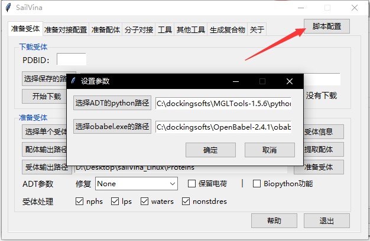

a\.
点击"选择ADT的python路径"选择mgltools里面的python.exe程序（注意路径不要包括中文和空格！！）。

b\.
点击"选择obabel.exe的路径"选择openbabel文件夹中的obebel.exe程序（注意路径不要包括中文和空格！！）。

c\. 配置完成重启该软件

### 3.1 获取受体

#### 3.1.1 通过SailVina进行获取 

a\. 在"准备受体"选项卡中，输入PDBID

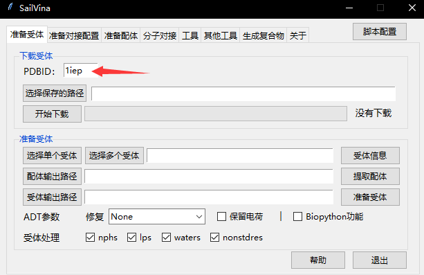

b\. 点击"选择保存的路径"，选择要保存pdb文件的位置。

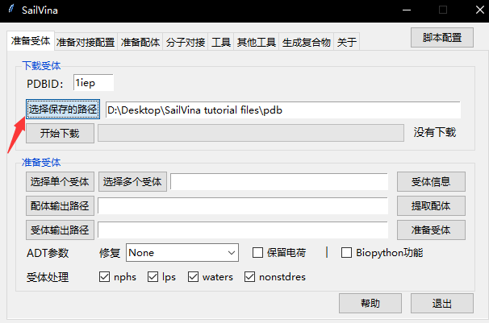

c\. 点击开始下载即可。

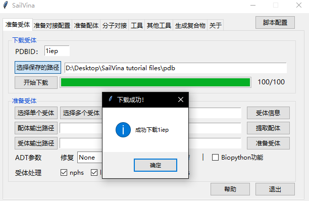

如果长时间连接不到服务器会报错。如果一直报错请尝试下面的方法。

#### 3.1.2 从pdb网站获取

a\.
进入pdb蛋白数据库网站<https://www.rcsb.org/>，输入PDBID、大分子名称等进行搜索。

b\. 选择相应的大分子，进入详细界面。点击Download
Files，从下拉菜单中点击PDB Format即可下载pdb文件。

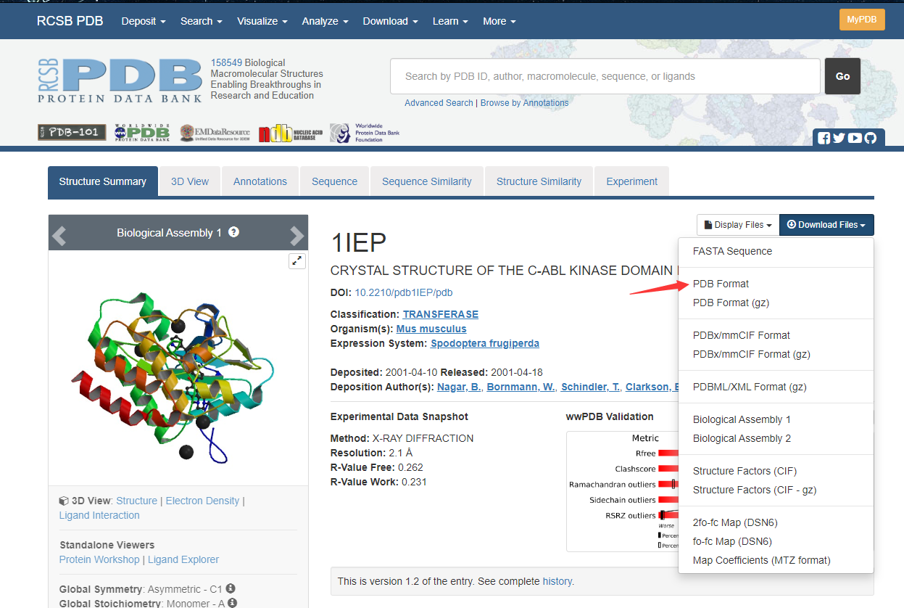

#### 3.1.3 通过同源建模获取pdb文件 

没做过，就不演示了(￣\_,￣ )

### 3.2 准备受体 

#### 3.2.1 使用SailVina自动准备受体 

a\.
在"准备受体"选项卡中点击"选择单个受体"选择需要准备的pdb文件。如果需要批量准备多个受体，点击"选择多个受体"，选择含有多个pdb文件的文件夹即可。

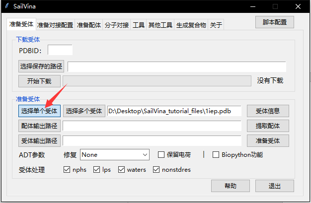

b\. 根据需求选择ADT参数和受体处理方式，一般保持默认即可。

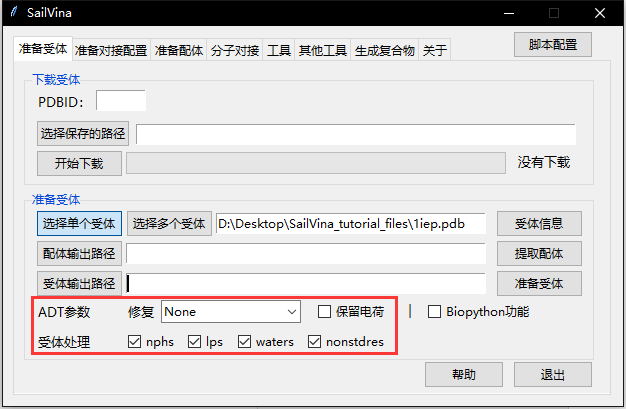

c\. 点击"受体输出路径"选择输出的文件夹。

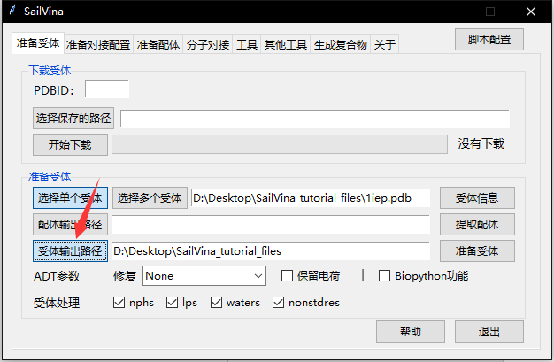

d\. 再点击"准备受体"即可。可以在命令窗口看到处理过程和结果。

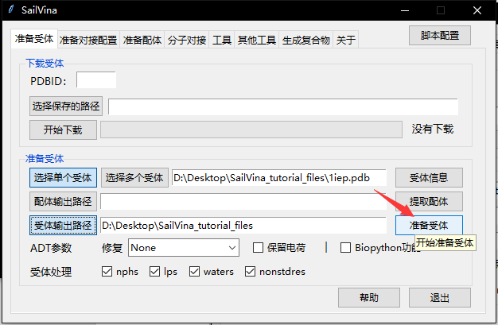

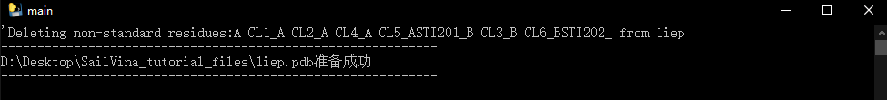

e\. 完成后点击"确定"即可。

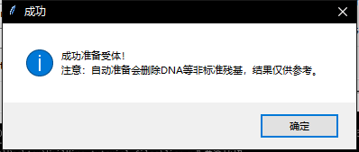

#### 3.2.2 使用ADT手动准备受体 

本方法适合于需要保留部分水和离子的pdb文件。

a\. 打开mgltools中的ADT.bat，默认开始菜单中也有。

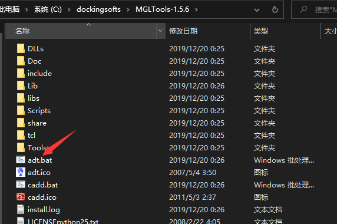

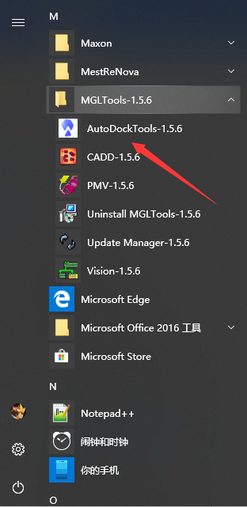

b\. 点击File，点击Read Molecule

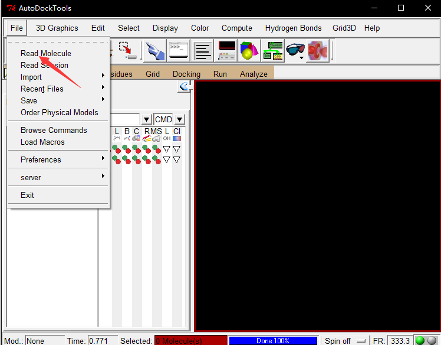

c\. 选择pdb文件即可加载至工作区。

d\. 根据需要删除水（Edit-\>Delete
Water）、配体（找到配体，点击相应的正方形，Edit-\>Delete-\>Delete
Selected
Atoms即可）、离子（找到离子，点击相应的正方形，Edit-\>Delete-\>Delete
Selected Atoms即可）等。

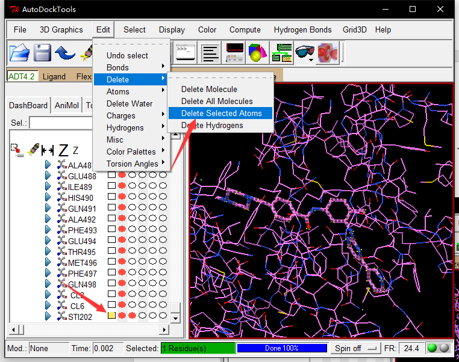

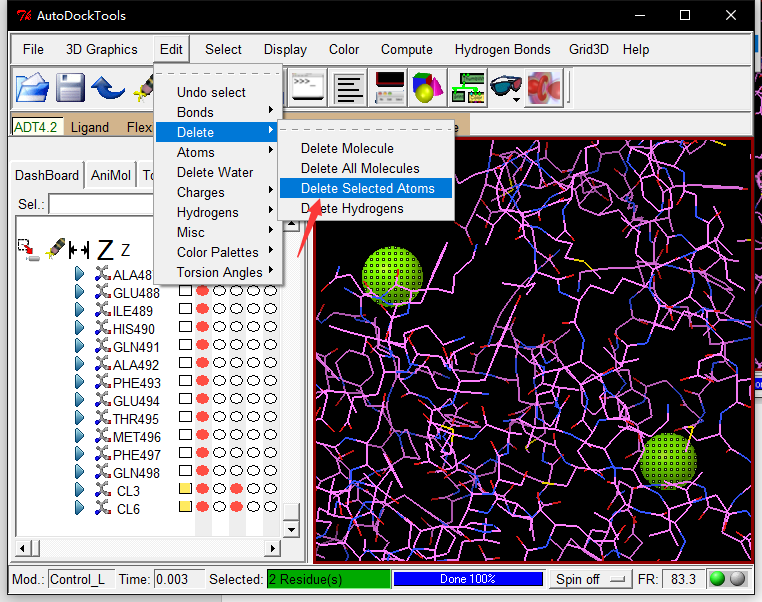

e\. 点击Grid-\>Macromolecule-\>Choose。

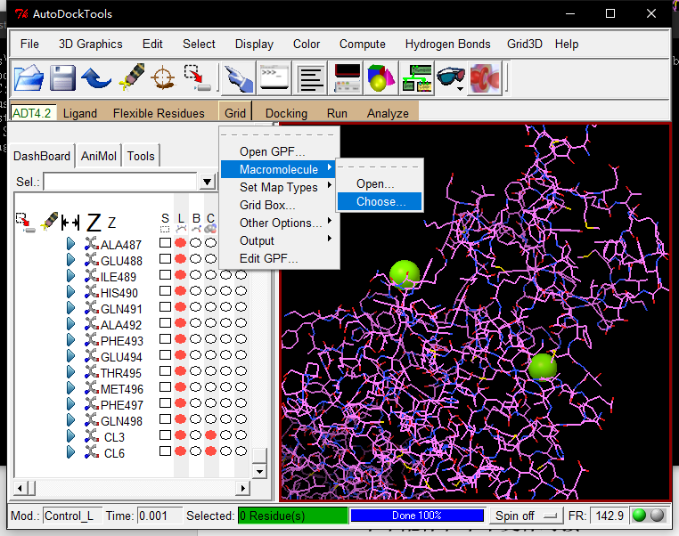

f\. 选择相应的pdb，点击Select Molecule。等待一段时间，当出现initializing
xxx.pdb后表示完成。点击确定，选择要保存的位置即可。

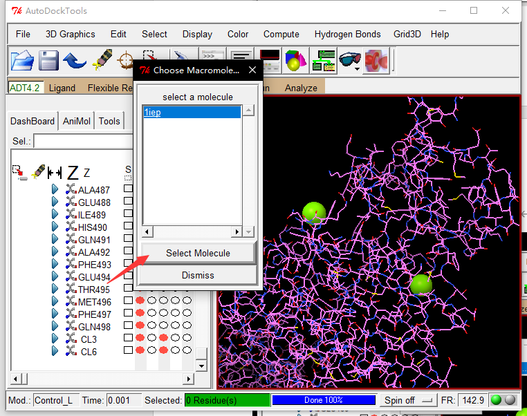

注意：如果保存了离子，这里的电荷是0，如果需要更改，使用记事本打开导出的pdbqt文件，找到相应的离子，修改后面的电荷即可。

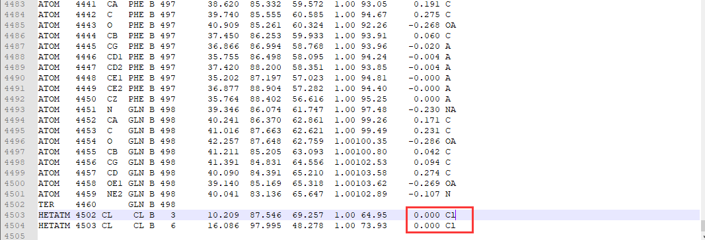

### 3.3 准备对接位点

#### 3.3.1 使用SailVina根据受体中共晶的配体来自动生成对接位点 

如果原始pdb文件中有共晶的小分子抑制剂等，那么该配体一般为活性位点，可以根据该配体自动生成对接位点。

a\. 参见[4.2](#42-提取pdb文件中的小分子配体)提取pdb文件中的小分子配体。

b\. 在"准备对接配置"选项卡中点击"读取共晶配体"，选择提取的小分子配体。

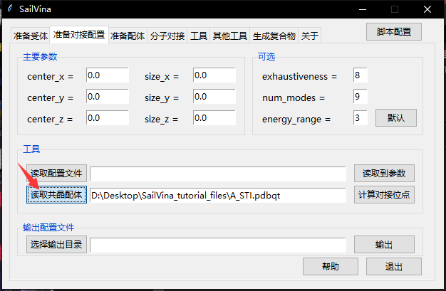

c\. 点击计算对接位点，会自动填充参数（参考文献：Feinstein, W. P., &
Brylinski, M. (2015). Calculating an optimal box size for ligand docking
and virtual screening against experimental and predicted binding
pockets. Journal of cheminformatics, 7, 18.
doi:10.1186/s13321-015-0067-5）。点击确定。

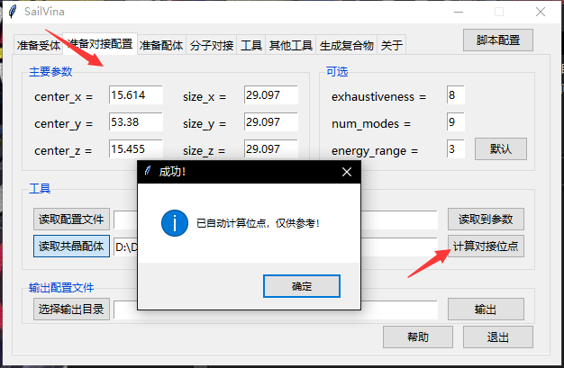

d\. 点击"选择输出目录"选择config.txt文件的输出目录。点击输出即可。

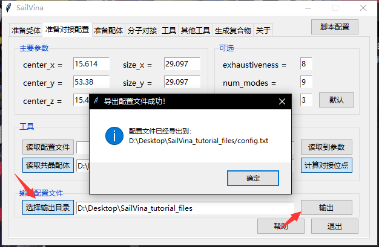

如果受体中没有小分子配体或者小分子过大，参考下面的方法。

#### 3.3.2 使用ADT来手动确定对接位点 

a\. 打开ADT，载入pdb文件。具体参考[3.2.2](#322-使用ADT手动准备受体)的a-c步骤。

b\. 点击"Grid",点击Grid Box会出现一个盒子。

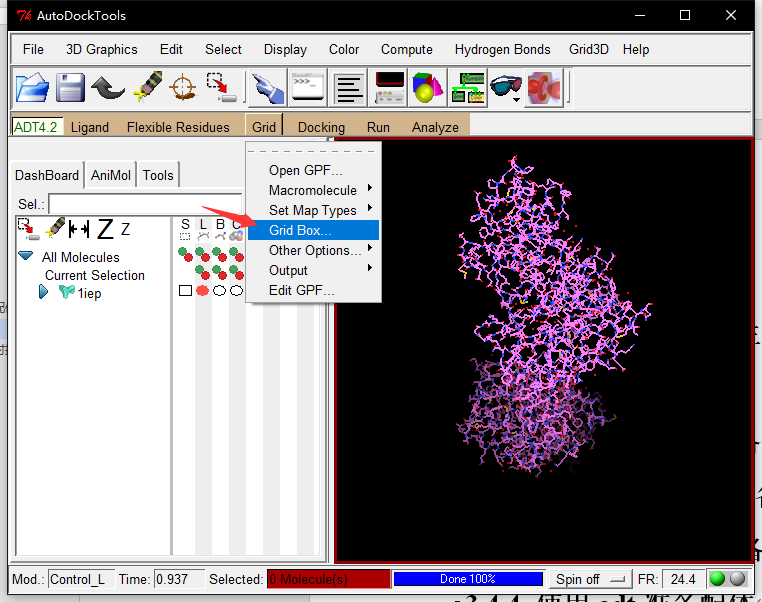

c\.
鼠标右键点击Spacing后面的"0.375"，在弹出的窗口中将"Value"修改为1.0（Vina定义的Spacing为1.0）。

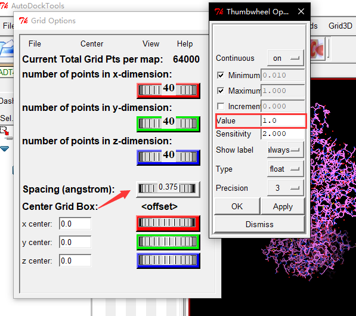

d\.
点击ok可以在视图中看到一个盒子。上面的三个参数表示盒子的"长、宽、高"，下面三个参数表示盒子的中心坐标。调节参数将盒子放到自己需要的位点。如果有配体需要将配体完全包裹起来，如果是空腔口袋请根据文献或者作用机理自行确定。

注意：

1\. 长\*宽\*高总数不要大于27000，即30\*30\*30，否则vina无法计算。

2\.
为了方便观察，可以将配体或者附近的残基显示为球棍或者球形。点击残基后面相应的圆即可。

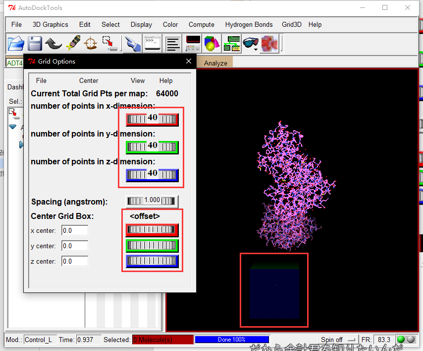

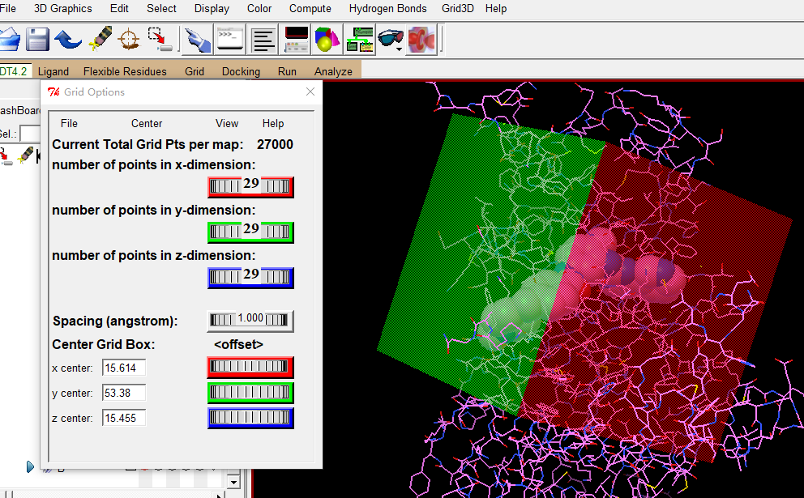

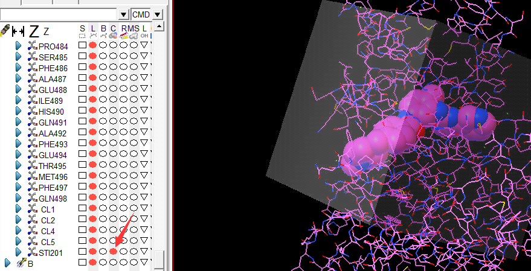

e\.
在SailVina中，"准备对接配置"选项卡中填入当前参数。选择输出目录，点击"输出"即可。

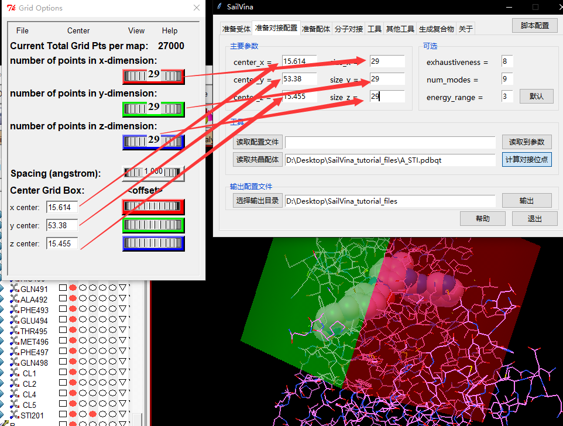

#### 3.3.3 使用SailVina来生成整个蛋白的对接位点 

如果实在不知道活性位点，可以使用该方法来对切分整个pdb文件进行对接。该方法需要一个参考配体。

在SailVina的"工具"中的"受体全局对接"中点击"选择配体"，选择需要对接的配体文件作为参考。点击"选择受体"选择需要全局对接的受体文件所在的文件夹。

注意：

1\. 受体必须命名为preped.pdbqt，否则无法找到受体。

2\.
如果是单个受体，选择这个文件夹。比如受体在D:/test/preped.pdbqt中，选择D:/test即可。

3\.
如果是多个受体，选择包含受体文件夹的文件夹。比如多个受体分别为D:/test/0001/preped.pdbqt和D:/test/0002/preped.pdbqt，选择D:/test即可。每一个子文件夹都会生成多个config文件。

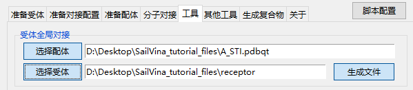

### 3.4 准备配体

#### 3.4.1 自己绘制配体 

a\.
在Chemdraw中绘制配体，保存为mol格式。从网站下载的mol文件也可以使用本方法。

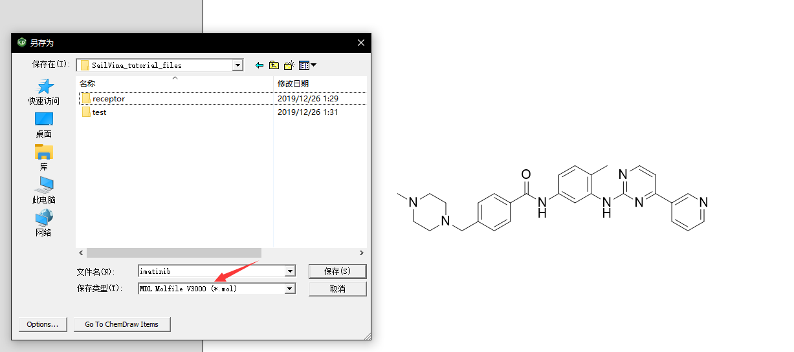

b\.
在SailVina的"准备配体"选项卡中，输入格式选择"mol"，选择刚才绘制的配体。如果有多个可以选择多个。也可以选择含有多个配体的文件夹。

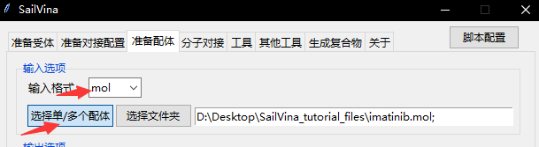

c\.
输出格式选择"pdbqt"，其余选项保持默认即可，如果有需要可以自行调整。选择输出文件夹，点击开始转换即可。

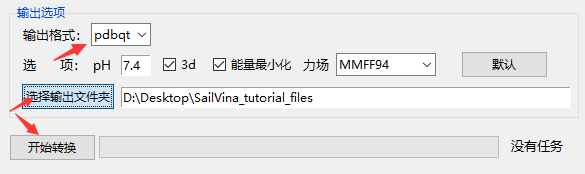

d\.
命令行和结果没有报错提示表示转换成功，如果出现问题可以尝试下面的方法。（mol转pdbqt先从mol转pdb再转pdbqt，出现两个是正常的）

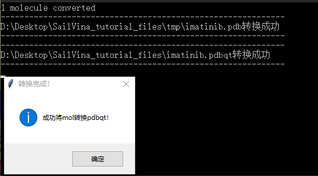

#### 3.4.2 从pdb中提取配体 

参考[4.2](#42-提取pdb文件中的小分子配体)提取配体即可。

#### 3.4.3 从网站获取 

以pubchem为例。

a\. 从"3D
Conformer"中下载SDF格式的文件。可以看到是一个已经有3D结构的配体。

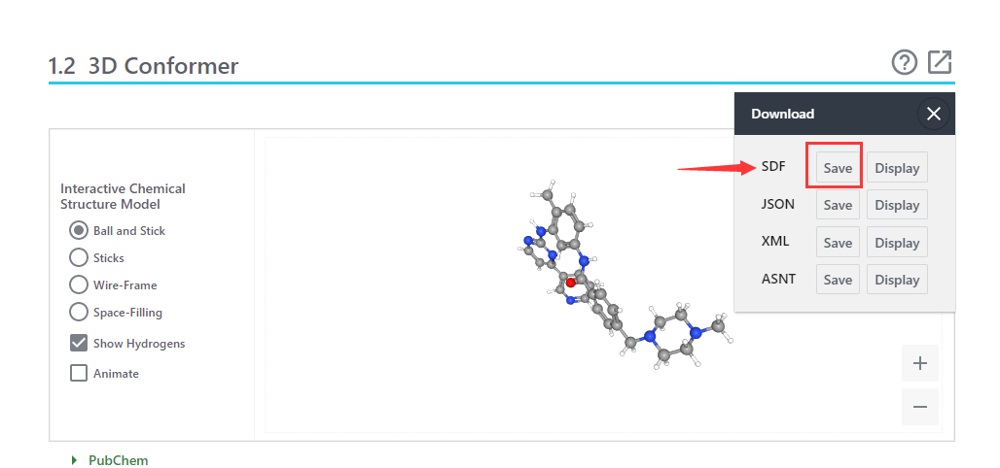

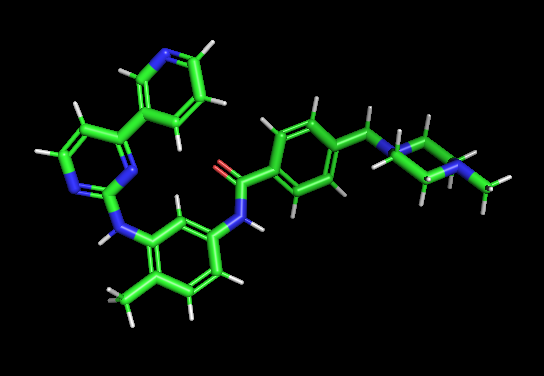

b\.
在SailVina的"准备配体"选项卡中，输入格式选择"sdf"，选择刚才下载的配体。如果有多个可以选择多个。也可以选择含有多个配体的文件夹。

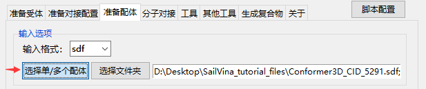

c\.
"输出选项"中，取消勾选3D和能量最小化。因为下载的配体只需要进行格式转换即可（如果sdf文件没有3D构型则需要勾选）。选择输出文件夹，再点击开始转换即可。

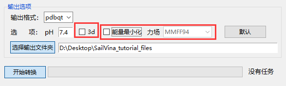

d\.
命令行和结果没有报错提示表示转换成功。（sdf转pdbqt先从sdf转pdb再转pdbqt，出现两个是正常的）

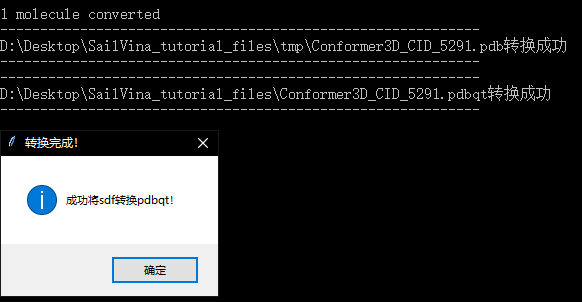

如果碰到无法转换问题，欢迎讨论。（比如有些糖苷类、分子量太大或者结构过于复杂，可以通过chemoffice中的chem3D使用MM最小化后再用SailVina转pdbqt格式，这里不做介绍）

### 3.5 分子对接 

#### 3.5.1 单个配体和单个受体对接 

a\. 准备受体，参考[3.2](#32-准备受体)，受体名字必须为preped.pdbqt。

b\. 准备配体，参考[3.4](#34-准备配体)，配体必须是pdbqt格式。

c\. 准备对接位点，参考[3.3](#33-准备对接位点)，生成一个或者多个config.txt文件。

受体文件夹如下：

d\.
在SailVina"分子对接"选项卡中，点击"选择单/多个配体"选择单个配体；点击"选择受体文件夹"选择受体文件夹；点击"输出文件夹"选择结果输出的文件夹。点击"开始对接"即可进行对接。

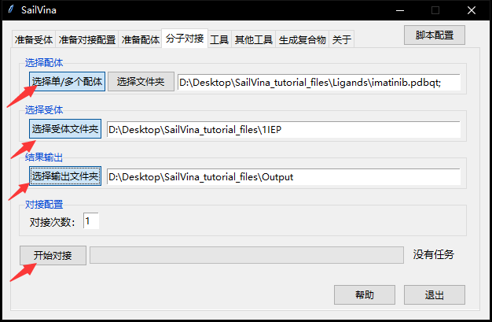

注意：此时会调用大量CPU资源，所以界面会出现无响应，等待命令行结束计算即可。

#### 3.5.2 单个配体和多个受体对接 

a\. 将需要准备的多个pdb文件放到同一个文件夹。

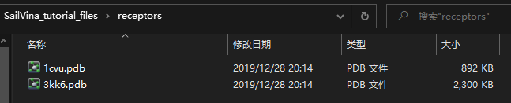

b\.
在"准备受体"选项卡中点击"选择多个受体"选择该文件夹。选择受体输出路径，再点击"准备受体"即可。

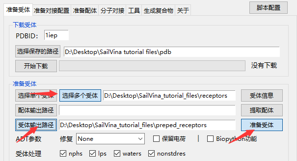

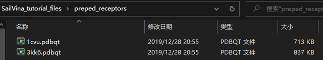

c\.
移动准备好的受体文件。参考[4.4](#44-批量移动单个pdbqt文件到独立的文件夹)操作，会自动将pdbqt受体放置到文件夹中并重命名为"preped.pdbqt"

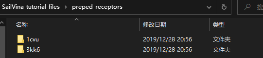

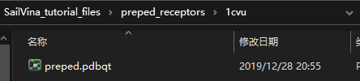

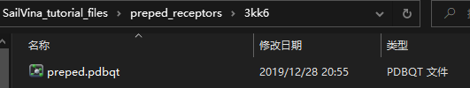

d\. 准备配体，参考[3.4](#34-准备配体)，配体必须是pdbqt格式。

e\. 准备对接位点，参考[3.3](#33-准备对接位点)，每个受体都需要生成config文件，需要自行准备。

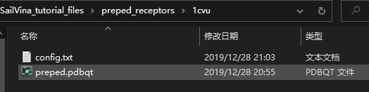

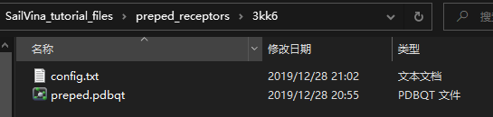

f\.
在SailVina"分子对接"选项卡中，点击"选择单/多个配体"选择单个配体；点击"选择受体文件夹"选择包含多个受体的文件夹；点击"输出文件夹"选择结果输出的文件夹。点击"开始对接"即可进行对接。

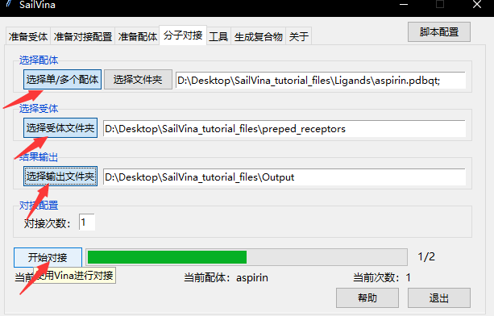

#### 3.5.3 多个配体和单个受体对接 

参考[3.5.1](#351-单个配体和单个受体对接)，选择配体时选择多个配体的文件夹即可。

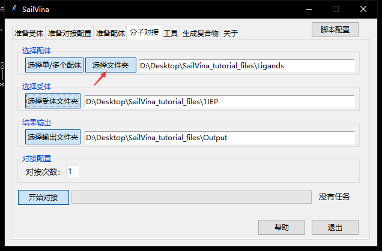

#### 3.5.4 多个配体和多个受体对接 

参考[3.5.2](#352-单个配体和多个受体对接)，选择配体时选择多个配体的文件夹即可。

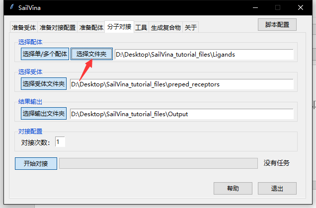

### 3.6 查看分数

#### 3.6.1 查看单个结果分数 

在"工具"选项卡中的"提取分数"中选择对接输出的一个文件，点击提取分数。

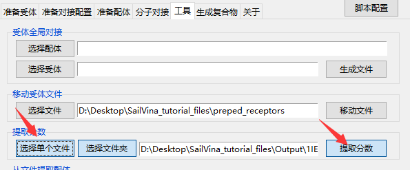

分数以悬浮窗口的形式出现

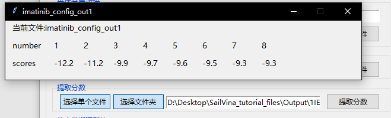

可以同时出现多个分数

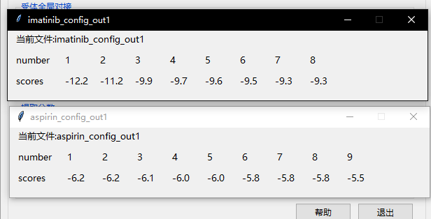

#### 3.6.2 查看多个结果分数 

在"工具"选项卡中的"提取分数"中选择对接输出的文件夹，点击提取分数。会输出一个分数txt文件到该文件夹中，可以使用excel打开该文件方便查看。

a\. 如果选择的是单个输出文件夹，输出文件是该输出文件中每个配体最小的分数

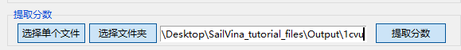

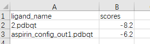

b\. 如果选择的是包含多个受体输出文件夹，输出文件包含受体信息。

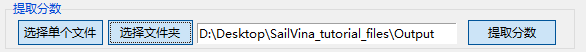

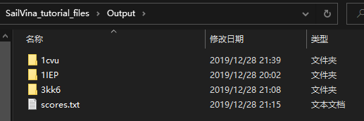

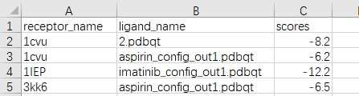

### 3.7 生成配体-受体复合物

配体-受体复合物可以用来做之后的作用力分析

a.  在"生成复合物"选项卡中点击"选择单/多个配体"选择对接输出的配体文件。同一个受体可以选择多个配体。

> 注：点击"提取配体输出路径"选择输出路径，再点击"提取选定的配体"可以对配体进行单独的提取。

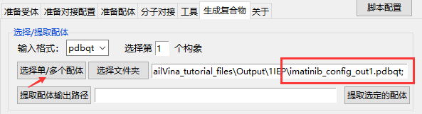

b\. 点击"选择受体"选择用来对接的pdbqt文件。

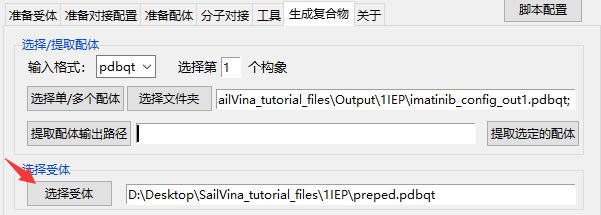

c\. 选择复合物输出的文件夹，点击"结合"即可。

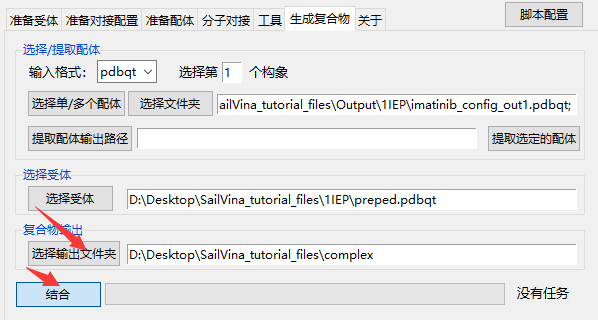

配体和受体会结合成一个文件，可以用来进行作用力分析。

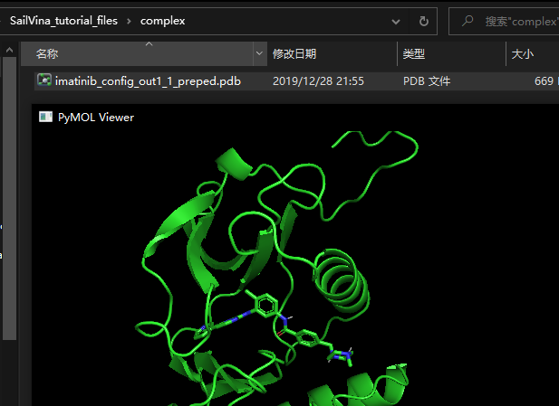

### 3.8 作用力分析

本软件没有集成，推荐使用plip。网址<https://projects.biotec.tu-dresden.de/plip-web/plip>。一个在线作用力分析软件，将复合物上传到该网站即可看到结果。

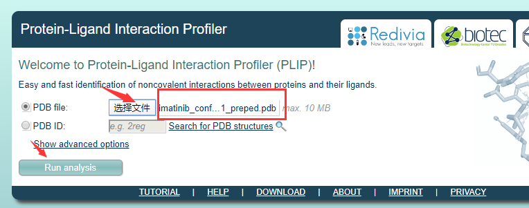

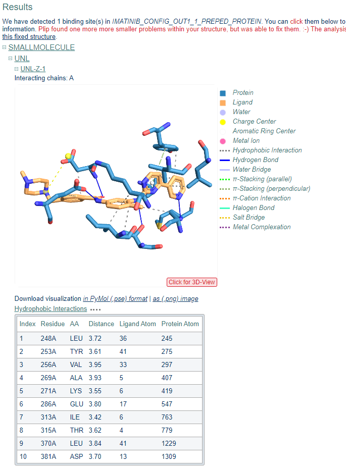

另外还有Ligplus，这里不做详细介绍。

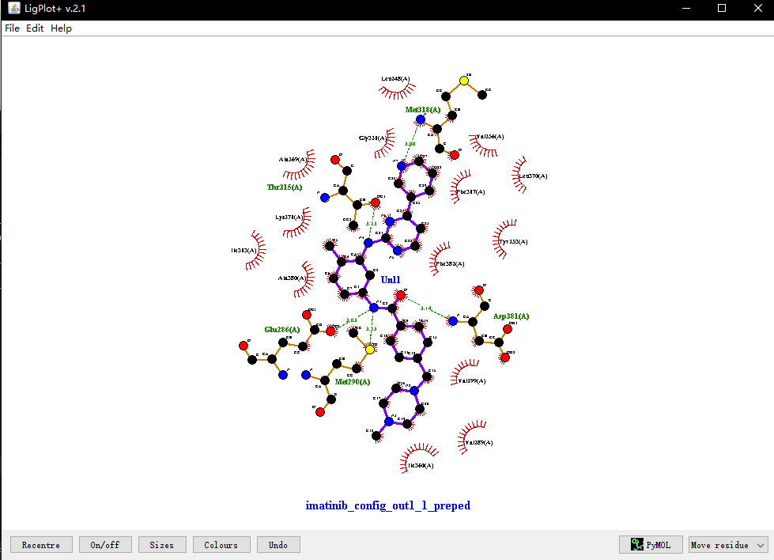

## 4. 其他功能 

### 4.1 查看pdb文件信息，跳转文献地址

只能查看从pdbbank上下载的或者符合pdbbank中pdb格式的文件（读取文件中的信息，不能凭空产生）。

a\.
在"准备受体"的准备受体框中选择单个受体。点击后面的"受体信息"按钮即可查看受体信息。

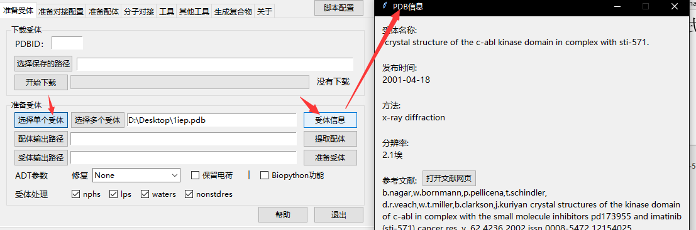

b\.
点击"PDB信息"窗口中的打开文献网址，会只用默认浏览器打开该文献（如果参考文献中没有doi信息则无法打开）。

### 4.2 提取pdb文件中的小分子配体

a\. 在"准备受体"选项卡中选择单个受体。具体参考[3.2.1](#321-使用SailVina自动准备受体)的a操作。

b\. 点击"配体输出路径"，选择配体输出的路径

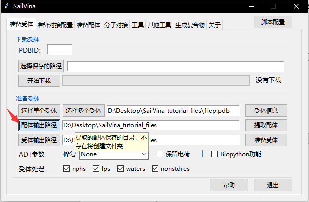

c\.
点击提取配体，依次选择model、chain、ligand。从ligand中选择要提取的配体，点击"提取配体"即可。

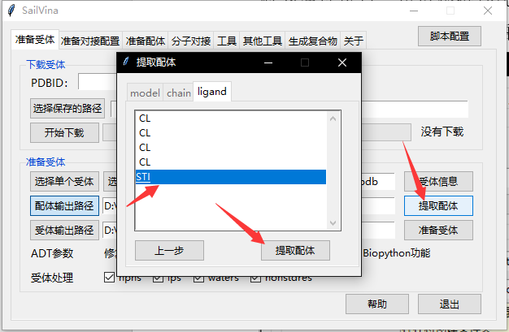

c\. 命令行和结果无问题即可。

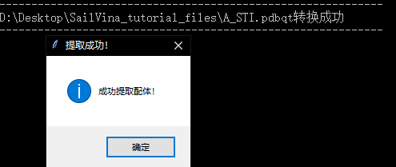

### 4.3 尝试修复pdb文件

如果某些pdb文件由于缺少残基或者某些地方丢失，可以使用biopython自动修复，具体参见[biopython](https://biopython.org/)官方文档。

a\. 选择单个受体。

b\. 选择受体输出路径

c\. 勾选biopython功能，点击准备受体

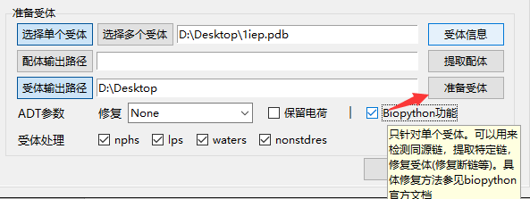

d\.
点击后会首先检测同源链，可以选择保留或者删除特定几条。这个根据需求，最好都试一下，有没有同源链对对接有一定的影响。

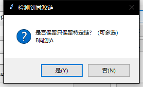

\--
如果选择保留特定链会出现选择链对话框，选择想要的链即可。如果需要多选，按住ctrl再点击想要的链。

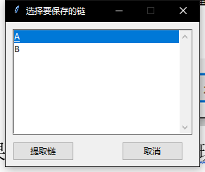

e\. 完成后有弹窗，如果有报错建议手动处理受体。

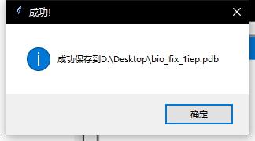

### 4.4 批量移动单个pdbqt文件到独立的文件夹 

需要同时准备多个受体时，因为对接需要重命名为preped.pdbqt并且在单独的文件夹中，需要使用此功能。

a\.
在"工具"选项卡中的"移动受体文件"中点击"选择文件"，选择多个受体所在的文件夹，再点击生成文件。

注意：这里只会移动pdbqt文件，其他文件不会移动。

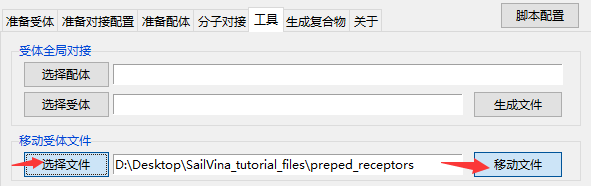

### 4.5 根据文本文件提取相应结果的配体

该功能通常用于虚拟筛选后，提取分数靠前的配体。

a.  参考[3.6.2](#362-查看多个结果分数)得到"scores.txt"文件。该文件包含多个配体和单/多个受体的最高打分。

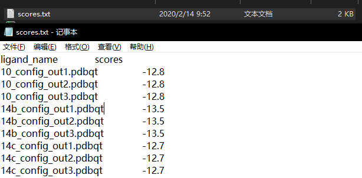

b.  在excel中排序，根据分数排序后，保留想要的配体，保存文件。

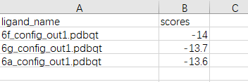
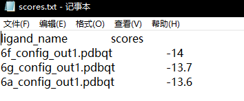

c.  在"工具"下的"从文件提取配体"中，点击"选择输入文件"，选择"scores.txt"。点击"选择提取目录"选择要提取的目录。

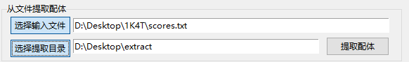

d.  点击提取配体即可。完成后后弹窗，输出目录有选择的文件。

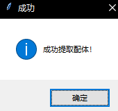
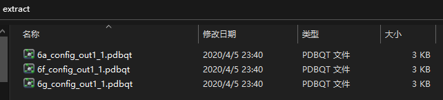

注：这里只会提取打分最高的文件。

### 4.6 快速生成相同骨架不同取代基的化合物库

该功能用于生成骨架相同，但是取代基不同的小分子化合物库。原理是通过smiles表达式，插入R基团组合生成化合物。通过修改other文件夹下面的substituents.txt文件来修改R基团，内置了一些常用取代基，需要对smiles表达式有一定的了解再进行修改。

a.  使用chemdraw画出通式（取代基用R表示）。选中该结构，在chemdraw中的Edit
    \--\> copy as \--\> SMILES (或者使用快捷ctrl+alt+c)。

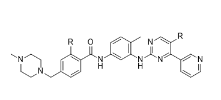

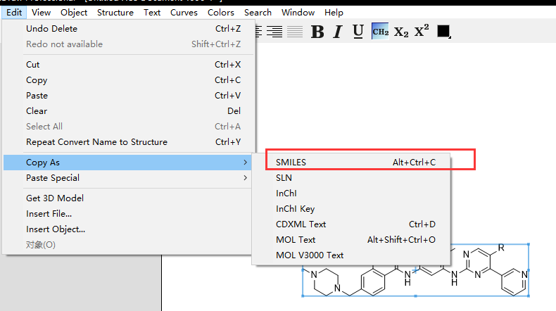

b.  粘贴该表达式，将其中的(\[R\])两边的括号去掉。

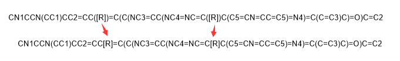

c.  在SailVina的其他工具中，点击"分子生成器"，在弹出窗口的"输入smi"一栏中粘贴刚才的SMILES表达式。选择输出目录。点击"生成衍生物"即可（取代基请根据需要修改！）。多个R会进行两两组合，所以文件会较多。

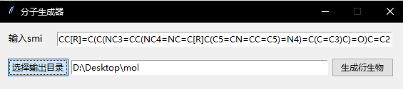

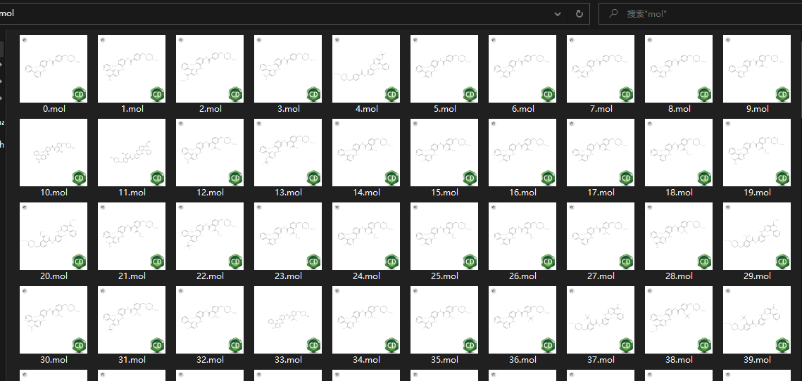

注：这是只是单纯替换R来完成库的生成，最好对库进行检查再进一步使用。

### 4.7 计算两个相同小分子之间的rmsd

RMSD表示均方根偏差，表示两个分子之间x, y,
z坐标的平均方差。该功能修改自<https://github.com/charnley/rmsd>的计算方法，源程序会将原子进行旋转再进行计算，求最小的RMSD值，而本方法不会对原子进行旋转。当然可以通过选择旋转方法来求RMSD，但是通常不用于分子对接后的计算。计算的分子结构必须一模一样，其中的原子表达形成可以不一样(CCNCC和CNCCC类似，只要表达的同一种分子即可，可以通过原子对齐来解决)。

a\.
使用"准备配体"选项卡将需要计算RMSD的分子转换成xyh格式(不要勾选3d和能量最小化)

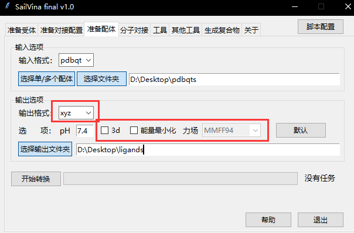

b\.
在"其他工具"选项卡中点击"计算RMSD"，弹出计算RMSD窗口。选择参考配体和第二个配体或者其余配体所在的文件夹。其余参数保持默认。

注：

\-
旋转方法表示对键进行旋转来计算最小RMSD，不能用于分子对接后的结果分析，因为相当于改变了分子的构象。

\-
原子对齐方法用来对齐原子表达不一样的分子，因为原始配体的分子表达方式和对接后的通常不一样，需要对齐后使用。该方法不会改变分子构象，但是可能会出现坐标不匹配的问题。如果发现结果不正常可以尝试修改对齐方法。

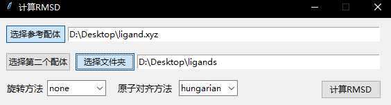

c\. 对于单个配体，结果以窗体弹出

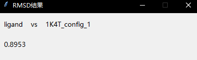

对于多个配体，将会在选择的文件夹中生成rmsd.txt，包含RMSD信息。

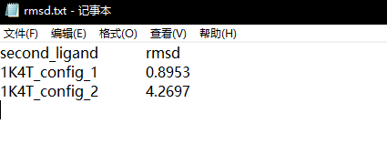

### 4.8 自动对接方案验证
（设置的最大RMSD为2埃，另外配体分子量小于500才会运行，目前不支持修改，可以在源码vina\_validator.py中修改首行的数值，在python版本中可以脱离SailVina单独运行）

该功能可以用来自动验证对接方案的准确性，可以匹配pdbbind数据库，无需处理pdbbind库就可以直接运行。如果是手动，需要准备的文件如下：

1\.
受体。命名必须是以protein结尾的pdb或者pdbqt文件（比如3ln1\_protein.pdb，3ln1\_protein.pdbqt），如果是pdb文件先尝试自动准备受体为pdbqt（参考[3.2.1](#321-使用SailVina自动准备受体)），如果是pdbqt文件，则默认为已经准备好的受体，不再进行处理。

2\.
配体。命名必须是以ligand结尾的sdf文件（必须包含3D坐标！）或者pdbqt文件（比如3ln1\_ligand.sdf，3ln1\_ligand.pdbqt）,如果是sdf文件会自动转为pdbqt（参考[3.4.3](#343-从网站获取)），如果是pdbqt文件，则默认为已经准备好的配体，不再进行处理。

3\. 活性位点。

\-
（选择一）pdbbind库中含有活性位点文件，为pdb文件，如果想要手动添加，命名必须是以pocket结尾的pdb文件（比如3ln1\_pocket.pdb）。该脚本会自动切割该位点，生成多个网格（30×30×30），在其中进行计算。

\-
（选择二）准备config.txt文件（参考[3.3](#33-准备对接位点)）放入文件夹中，会以该位点进行计算。

\-
（选择三）不放入活性位点，则将整个受体切割成30×30×30的网格，逐一进行计算。

步骤如下：

a\.
选择"其他工具"选项卡，点击"Vina一键验证"。弹出窗口中选择含有上述文件的文件夹即可。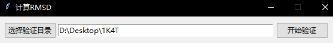

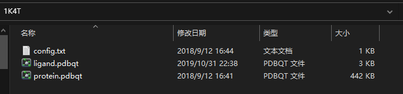

b\.
脚本会自动进行处理，最后在该文件夹中生成中间文件和report.txt报告文件。

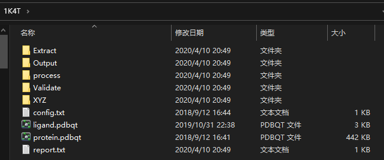

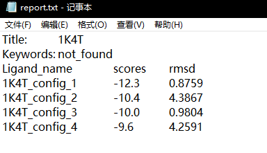

该脚本的处理过程如下：

1\.
识别受体，配体，位点。进行格式转换，完成后放置到process文件夹中。其中如果该文件夹命名是PDBID，则会首先联网，进入pdbbank数据搜索受体信息，最后输出到report.txt文件中。（如果连接长时间无响应结果会显示not
found）。

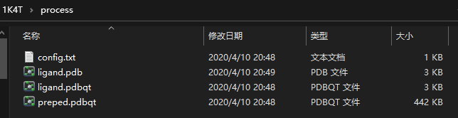

2\. 开始分子对接。结果文件放置到Output文件夹中。

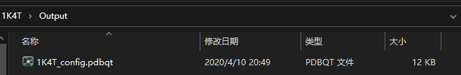

3\. 提取对接结果的每个构象，到Extract文件夹中。

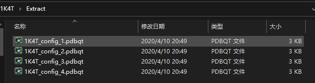

4\. 转换成XYZ格式，放置到XYZ文件夹中，并计算每个构象和原始配体的RMSD。

5\. 生成报告，将RMSD小于2埃的结果放置到Validate文件夹中。

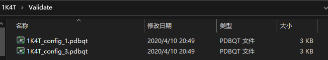

之后根据需求取相应的文件后续使用即可，通常小于1.5埃即可认为该对接方案有效。

## 5. 常见问题 

### 5.1 如果要发表论文需要引用吗？

SailVina只是业余编写的脚本，本质只是调用了Autodock
Vina和Openbabel，如果要引用请引用这两个软件：

Autodock Vina引用说明网址：<http://vina.scripps.edu/>

\[1\] O. Trott, A. J. Olson, AutoDock Vina: improving the speed and
accuracy of docking with a new scoring function, efficient optimization
and multithreading, Journal of Computational Chemistry 31 (2010) 455-461

Openbabel引用说明网址:

<https://openbabel.org/wiki/Frequently_Asked_Questions#How_do_I_cite_Open_Babel_in_a_paper.3F>

\[2\] N M O\'Boyle, M Banck, C A James, C Morley, T Vandermeersch, and G
R Hutchison. \"Open Babel: An open chemical toolbox.\" J. Cheminf.
(2011), 3, 33.

\[3\] The Open Babel Package, version 2.3.1 http://openbabel.org
(accessed Oct 2011)

其中：

\[2\]是引用Openbabel软件描述，比如说openbabel的原理，作用等。

\[3\]是引用Openbabel这个软件，比如用openbabel转格式。注意不同的版本标注不同，如果不是2.3.1请查看官方的说明。

### 5.2 受体中有金属离子，添加的电荷应该是多少？

官方解释如下：

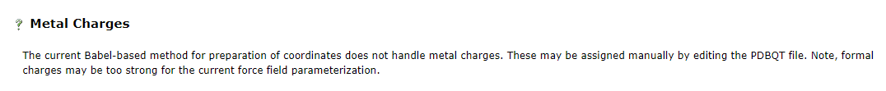

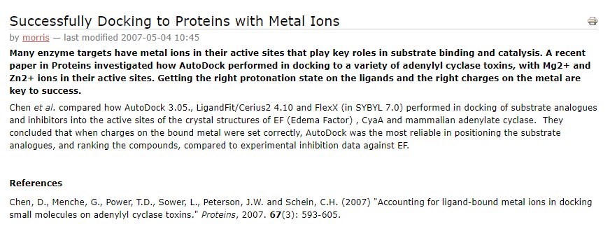

原子电荷如何计算由于我没有做过，只是提供思路，如果有知道的同学欢迎讨论分享。

### 5.3 Vina对接的分数和Ki/Kd如何转换？

官方解释如下：

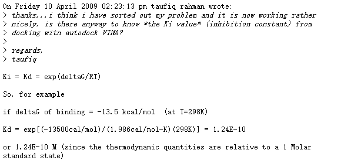

首先Vina打分为ΔG

Ki = kd = exp(ΔG/RT)

R为理想气体常数=1.986 cal/K

假设打分为-13.5 kcal/mol，室温(25 °C, 298K)下，那么Ki = Kd =
e^(-13.5\*1000/1.986\*298) = 1.24 \*10^-10 M = 0.124 nM
